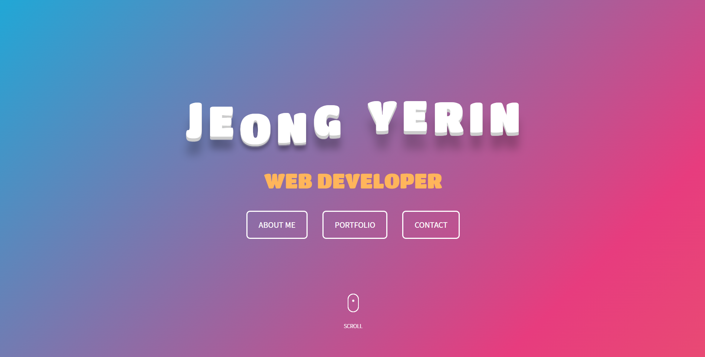

# YeRin07 포트폴리오 웹사이트

포트폴리오를 목적으로 제작한 **Vanilla JS** 기반의 웹사이트입니다.  별도의 UI 라이브러리를 사용하지 않고 기본에 충실하게 만드는 것을 목표로 제작한 **포트폴리오 웹사이트**입니다.

**링크 : <https://yerin07.github.io/>**  
  

## 🛠 제작기간&참여인원
-2021년 8월 16일 ~ 2021년 12월 6일  
  

## ✏ 개요
- 서비스 : 포트폴리오 웹사이트
- 개발 환경 : Visual Studio Code
- 개발 언어 : Javascript
- 배포 : GitHub